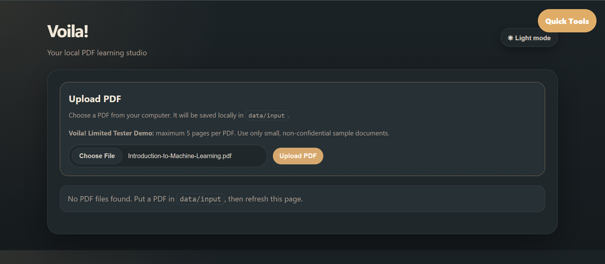
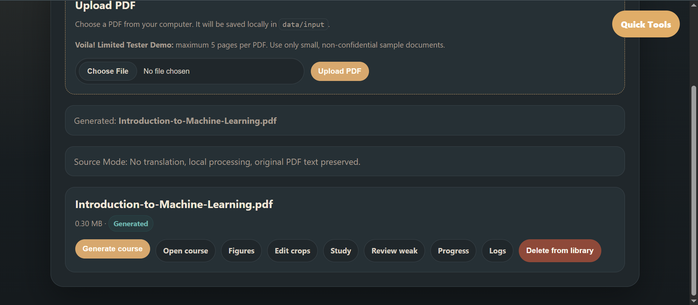
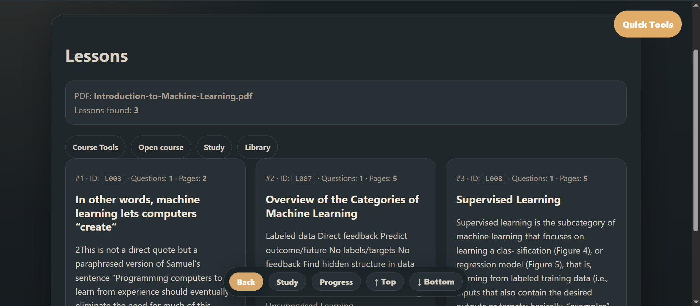
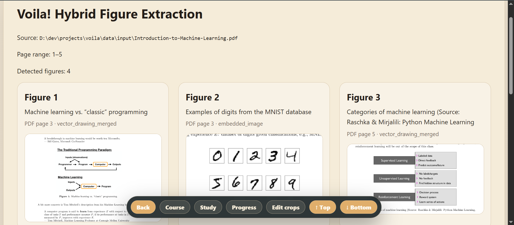
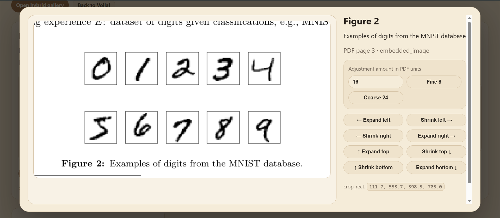
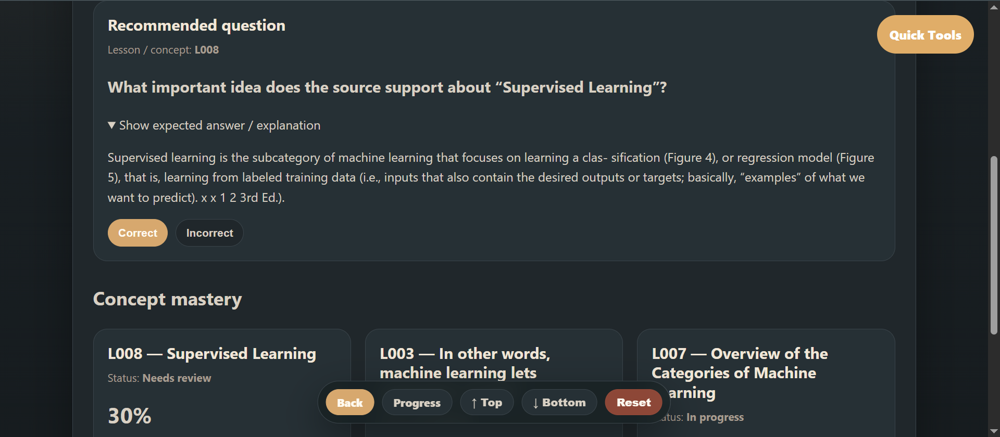
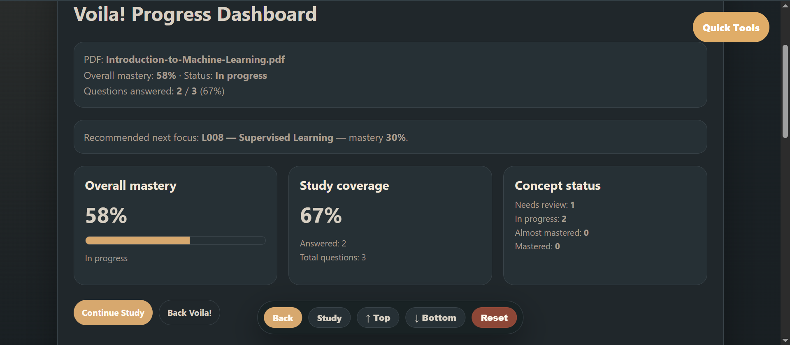
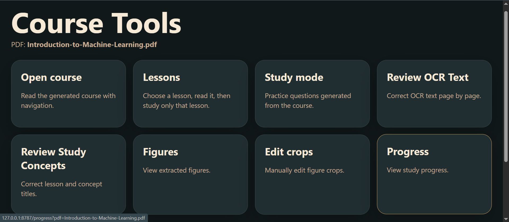

# Voila!

**Your local PDF learning studio.**

Voila! turns PDF documents into structured, study-ready courses with lessons, extracted figures, OCR review tools, study questions, and progress tracking.

Voila is currently in **public beta**.



---

## What is Voila?

Voila helps you turn static PDF files into a more practical learning workflow.

Instead of reading a long PDF page by page, Voila helps you:

- upload a PDF locally
- generate a structured course
- open generated lessons
- inspect extracted figures
- review and adjust OCR crops
- study recommended questions
- track concept progress
- use course tools from one place

Voila is designed for people who study from PDFs: students, technical readers, trainers, engineers, researchers, documentation-heavy professionals, and self-learners.

---

## Public beta status

Voila v0.3.x is a **public beta**.

Current focus:

- validate the Windows tester package
- collect feedback from early users
- improve PDF-to-course quality
- improve OCR and figure workflows
- improve study and progress tools
- polish documentation and public showcase materials

Beta note: generated learning content should be reviewed by the user, especially for technical, professional, or academic documents.

---

## Screenshots

### 1. Upload PDF

Start by selecting a PDF from your computer. The tester demo is designed for small, non-confidential sample documents.


### 2. Generated course library

After upload and generation, Voila shows the PDF in the local library with course actions such as Generate course, Open course, Figures, Edit crops, Study, Progress, and Logs.



### 3. Lessons

Generated courses are split into lessons, making the PDF easier to review and study.



### 4. Figures

Voila extracts and displays figures separately, which is useful for diagrams, charts, illustrations, and technical content.



### 5. Edit crops

The crop editor helps review and adjust figure/OCR regions when a document needs cleanup.



### 6. Study mode

Study mode recommends questions generated from the course content and lets users mark answers as correct or incorrect.



### 7. Progress dashboard

The progress dashboard shows overall mastery, study coverage, concept status, and recommended next focus.



### 8. Course tools

Course Tools provides a central place for opening the generated course, lessons, study mode, OCR review, figures, crop editing, and progress.



---

## Features

### PDF to course generation

Voila transforms a PDF into structured learning material, including lessons and study artifacts.

### Local-first workflow

The app runs locally on the user's Windows machine during beta testing. No cloud account is required for the local tester workflow.

### OCR-assisted review

Voila includes OCR-related tools for PDFs where text extraction is incomplete, scanned, or imperfect.

### Lessons

Generated lessons make the document easier to read, navigate, and study.

### Figure extraction

Figures are surfaced separately so users can inspect diagrams and visual information without hunting through the original PDF.

### Crop editing

Users can review and adjust crop areas to improve figure extraction and OCR-related workflows.

### Study mode

Voila generates recommended questions from the course content and supports simple review actions.

### Progress tracking

Progress tools help users see what they have studied and which concepts need more review.

---

## Quick start

1. Download the public beta runtime package from GitHub Releases. Use the release explicitly identified as the public beta runtime package; later tester/demo builds or release-candidate materials may include limits or non-runtime changes.
2. Extract the ZIP archive.
3. Run the included start script.
4. Open the local Voila interface in your browser.
5. Upload a small PDF.
6. Generate a course.
7. Review Lessons, Figures, Study, Progress, and Course Tools.
8. Send feedback.

For limited tester demo builds, use small, non-confidential sample PDFs.

---

## Architecture overview

Voila uses a local-first architecture for the public beta tester workflow.

```text
PDF document
   ↓
Local upload
   ↓
Text extraction + OCR support
   ↓
Course generation
   ↓
Lessons + figures + study questions + progress
   ↓
Local study workflow
```

Main components:

- local FastAPI service
- local browser-based UI
- PDF extraction workflow
- OCR tooling
- LanguageTool integration
- generated course artifacts stored locally

The goal is to keep early testing simple: download, extract, start, upload PDF, generate course, study.

---

## Roadmap

### v0.3.x public beta polish

- improve README and showcase materials
- improve screenshot-based documentation
- collect structured tester feedback
- simplify tester onboarding
- improve troubleshooting notes

### Learning workflow

- improve generated lesson quality
- improve study questions
- improve flashcards and review flows
- improve progress and concept mastery signals

### OCR and figures

- improve figure extraction
- improve crop editing workflow
- improve OCR review workflow
- improve document diagnostics

### Packaging

- simplify Windows tester package
- improve start/stop scripts
- improve local smoke checks
- improve release checklist

### Monetization and distribution

- evaluate supporter package
- evaluate professional package
- keep licensing and commercial decisions flexible during beta

---

## Feedback

Voila is looking for practical feedback from early testers.

Useful feedback:

- Was Voila easy to start?
- Was PDF upload clear?
- Did course generation work?
- Were the lessons useful?
- Were the figures useful?
- Was study mode helpful?
- Was progress tracking understandable?
- What was confusing?
- What should be improved first?
- Would you use Voila again with another PDF?

See:

- `docs/public/FEEDBACK-COLLECTION-PLAN.md`

---

## Public showcase docs

Additional public presentation material:

- `docs/public/LANDING-PAGE-CONTENT.md`
- `docs/public/SCREENSHOT-SHOWCASE-GUIDE.md`
- `docs/public/FEEDBACK-COLLECTION-PLAN.md`
- `docs/public/screenshots/README.md`

---

## License and beta terms

Voila is currently shared as public beta software.

Public GitHub visibility does not mean that Voila is open-source licensed.

Unless a separate written license agreement says otherwise:

- all rights are reserved
- commercial redistribution is not allowed
- resale is not allowed
- repackaging under another brand is not allowed
- modified commercial derivative products are not allowed
- paid hosting or software-as-a-service redistribution is not allowed

The public beta package is intended for evaluation, testing, feedback, and personal/internal learning workflows.

Some later tester/demo builds may include additional limits, such as page-count limits, demo restrictions, or release-candidate-only materials.

See:

- `LICENSE.txt`
- `BETA-TERMS.md`
- `docs/legal/THIRD-PARTY-NOTICES.md`

## Repository

GitHub repository:

```text
CyberXecure/voila
```

---

## Disclaimer

Voila is beta software. Generated content may contain extraction, OCR, formatting, or interpretation errors. Always review generated course material before using it for professional, academic, or technical decisions.
